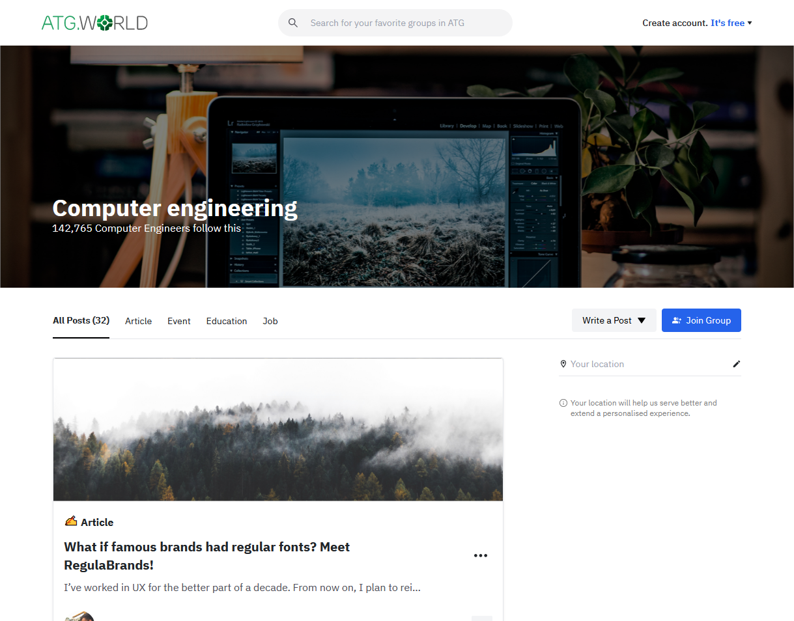

# ATG React.JS Development task 01

<h3 align="left">🛠 Technologies & Tools used:</h3>

<h3 align="left">NOTE:</h3>

In this task, I use TailwindCSS because it was hard for me to implement a pixel-perfect solution with just Bootstrap. And due to the short deadline as well, so there is no enough time to learn more and more about Bootstrap as I'm not used to it...

But In the professional work journey (after being accepted), I can learn any technologies needed that time...
